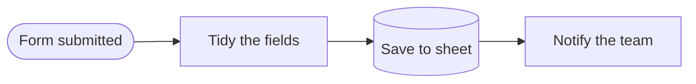
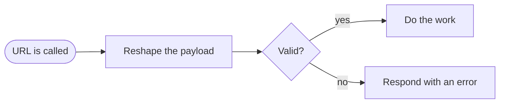
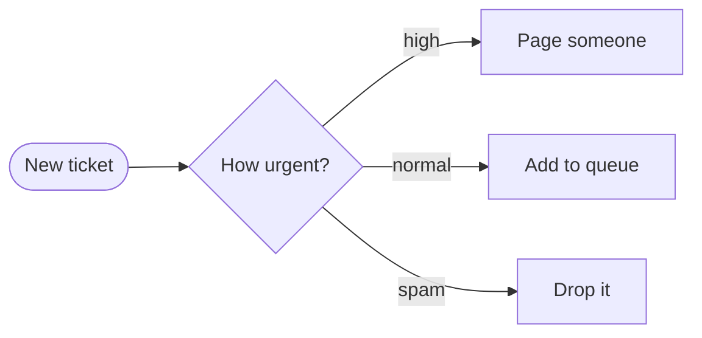
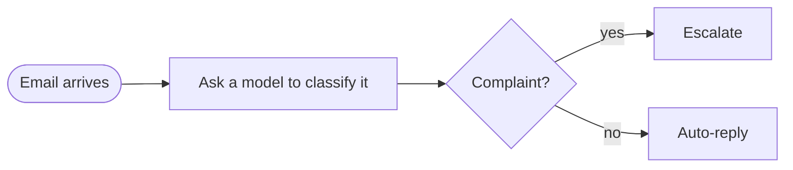

# n8n Demo — instructor material

Three tiny workflows for the session where you explain n8n to the class. They
are the setup for Final Project 1: the students see the real tool, find it
confusing in specific ways, and then get asked to redesign it.

**This folder is for the instructor.** Students don't need to import anything —
they watch, and they screenshot.

## Before the session

Start n8n on your machine — **not** plain `npx n8n`, see the section at the
bottom for why:

```bash
npx n8n@1
```

Open http://localhost:5678.

**First launch asks you to create an owner account** — email, name, password.
There is no way to skip it in n8n 1.97; the option was removed. The account is
local only: it lives in a sqlite file on your machine and is not sent anywhere.
Create it once, before the session, not while the room waits.

Then import each file: **Workflows → ⋯ (top right) → Import from File**.

Import all three before class, not during it. Do it once on the machine and
projector you'll actually teach from.

## Before you tell students to install anything

Read [`foundations.md`](foundations.md) first — it is the concepts and the
nodes, written for designers, with diagrams. Send it to the students too.

Then read [`sharing-your-instance.md`](sharing-your-instance.md). Twenty Windows
laptops each downloading a gigabyte is a real cost, and for this session there
is a cheaper option. The student-facing install guide, if you do want it, is
[`setup-windows.md`](../final-project-1/resources/setup-windows.md).

For the other half of the course — n8n as a tool that works *for* designers
rather than one they redesign — see
[`automations-for-designers.md`](automations-for-designers.md). It has the
integrations, five pipelines they could actually use, and three project ideas.

## The pipelines worth knowing

Almost every real automation is one of these five shapes. Show them the shapes,
not the four hundred integrations — a designer who recognises these can read
any canvas they are handed.

### 1. Collect → store → notify

The most common automation on earth.



*"When someone fills my contact form, add them to my sheet and message me."*

**Design note:** the user only ever notices this one when it stops working.
Silence is the normal state. That makes the failure notification the entire
user experience.

### 2. Scheduled report


*"Every morning, send me what sold yesterday."*

**Design note:** runs while nobody is watching. If it fails at 8am on a Friday,
when does the user find out? Your dashboard is the answer to that question.

### 3. Webhook → transform → respond



*"When the payment provider calls us, record the order."*

**Design note:** this fires unattended, often, and fast. A hundred runs an hour
is normal. A run list designed for three runs a day falls apart here.

### 4. Route by condition



*"Urgent ones wake someone up, the rest wait until morning."*

**Design note:** this is the canvas problem in miniature. Three routes fit on
screen. Eight do not. How do you show a user which route *their* item took,
without making them read the whole map?

### 5. Anything → AI → act on the answer



*"Read the email, decide what it is, handle it."*

**Design note:** the AI step takes seconds and sometimes returns nonsense. Two
design problems fall out of that: waiting, and doubt. How does the interface
show that a step is *thinking*, and how does a user check whether it thought
correctly? Very few products answer this well — which makes it worth designing.


## The workflows

| File | Runs for | The point |
|---|---|---|
| `01-hello-automation.json` | ~5 min | Data goes in one side of a node and comes out the other. That's all a workflow is. |
| `02-branch-and-decide.json` | ~10 min | Workflows split. The canvas stops being a line. |
| `03-this-one-breaks.json` | ~15 min | It fails, and the failure screen is bad. This is the project brief. |

Each one has a sticky note on the canvas with the lesson and the questions to
ask. Read them before you teach — the questions are the part that matters, not
the workflows.

## Running order, with the timing

**1. Hello automation (5 min).** Run it. Click each node. Point at the
input/output split and say: this is the only concept in n8n. Everything else
is a variation.

**2. Branch and decide (10 min).** Run it with `total = 210`, then change it to
`50` and run again. Let them watch the path change. Then ask the canvas
question on the sticky — how do you show *which path my data took* without
drawing the whole map? Don't answer it. It's their project.

**3. This one breaks (15 min).** Run it. Say nothing for thirty seconds. Let
them read the failure screen cold and get annoyed by it. Then ask the four
questions on the sticky.

**Tell them to screenshot this screen.** It goes in `01-research/` and it is
the thing deliverable 4 asks them to redesign.

## Why these are deliberately ugly

No colour, no clever nodes, no AI step. Designers in a room with a new tool
will look at the tool's visual design and have opinions about the shade of
grey. These workflows give them nothing to look at, so they look at the
*structure* — which is the thing you actually want them arguing about.

## Then show them the real thing

After the three demos, open your own n8n with real workflows in it, if you have
any. The jump from three clean boxes to an actual messy instance is the moment
the project stops being abstract. Twenty workflows, half of them failing, is a
better brief than anything written down.

Skip this if your real instance has client data in it.

## Verified

All three were imported and executed on **n8n 1.97.1** on this machine, and
they do what the stickies say:

| Check | Result |
|---|---|
| All three import | 3/3 |
| `01` computes the total | `total_with_tax: 97` |
| `02` true branch (`total = 210`) | goes to *Big order — tell the manager*, message renders |
| `02` false branch (`total = 50`) | goes to *Normal order — just log it* |
| `03` fails at the HTTP node | `ENOTFOUND` — "The connection cannot be established" |

Node type versions (`set` 3.4, `if` 2.2, `httpRequest` 4.2) are the current
defaults in 1.97.1.

## Starting n8n on this machine — read this

Plain `npx n8n` **will not work here.** Two reasons:

1. The default `node` on this machine is Anaconda's **v20.12.2**. Current n8n
   (2.x) requires Node **>= 24**, so npx installs it and then refuses to start.
2. Node 24 *is* installed via Homebrew, but it is not first on the PATH.

Two options.

**Stay on n8n 1.x (what these files were tested against):**

```bash
npx n8n@1
```

Runs on Node 20, no PATH changes, and does not migrate your existing `~/.n8n`
database.

**Or move to n8n 2.x:**

```bash
PATH="/opt/homebrew/bin:$PATH" npx n8n
```

This opens your June database with n8n 2, which **migrates it one way**. There
is a copy at `~/.n8n-backup-before-v2` taken before any of this. The three
workflows here have not been tested on 2.x.

If an install ever dies partway with a network timeout, the npx cache is left
broken and every later run fails with a missing-module error. Clear it and
start over:

```bash
rm -rf ~/.npm/_npx
```
