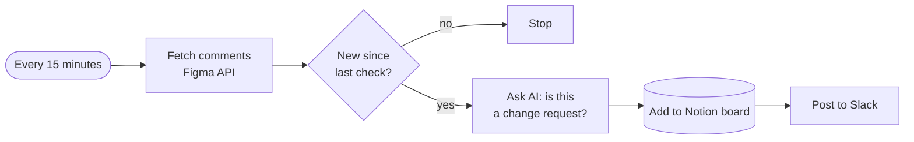
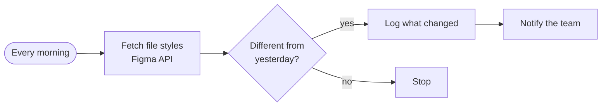
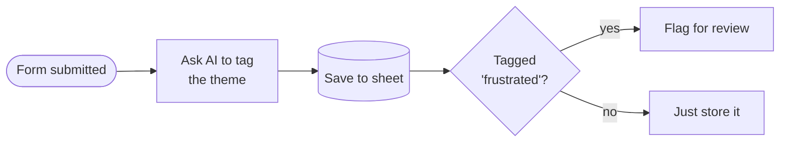
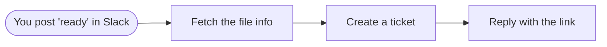
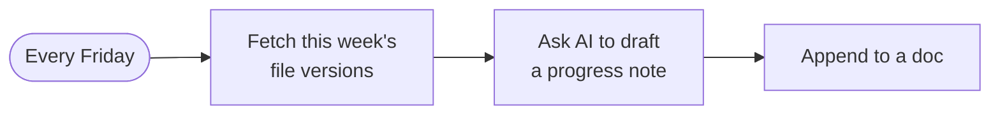

# Automations a designer would actually use

Everything so far treats n8n as the thing being redesigned. This page flips
it: n8n as a tool that does your students' unglamorous work for them.

This is the material for the "AI in UI/UX" half of the course. The project
ideas at the bottom are buildable by someone who writes no code.

---

## What connects to what

The tools designers already live in, and how n8n reaches them.

| Tool | How n8n connects | Needs paying? |
|---|---|---|
| **Figma** | HTTP Request node → Figma REST API, with a personal access token | No, for reading |
| **Slack** | Built-in node | No |
| **Notion** | Built-in node | No |
| **Google Sheets / Drive** | Built-in node | No |
| **Gmail / Calendar** | Built-in node | No |
| **Jira / Linear / Trello** | Built-in nodes | Depends on the tool |
| **Typeform / Google Forms** | Built-in node, or n8n's own Form trigger | No |
| **Miro** | HTTP Request → their API | No |
| **OpenAI / Claude / Gemini** | Built-in AI nodes | Yes — per use, small |

### The Figma caveat, read it before promising anything

Figma has two ways in, and only one of them is free:

- **Reading** — any plan. Create a personal access token in Figma settings,
  call the REST API with the HTTP Request node. You can read files, styles,
  components, versions and **comments**. This is where almost all the value is.
- **Webhooks** (Figma pushing to you the moment something changes) — these
  need a paid Figma plan, and at the time of writing the exact tier should be
  checked against Figma's current docs rather than assumed.

So every pipeline below uses **polling**: a Schedule trigger asks Figma "has
anything changed?" every few minutes. Slower than a webhook, works for
everyone, costs nothing.

---

## Five pipelines worth building

### 1. Feedback inbox — stop losing Figma comments

The problem every designer has: feedback arrives as comments scattered across
twelve Figma files, and the ones that matter get buried under "looks great".

**Why it's good:** it solves a real daily annoyance, and the AI step earns its
place — separating "please move this 4px" from "nice work" is genuinely
fuzzy, and a keyword filter can't do it.

**Difficulty:** moderate. The hard part is remembering which comments you have
already seen — store the timestamp of the last one in a sheet.

---

### 2. Design system drift watcher

**Why it's good:** design systems change silently and nobody tells the
developers. This builds a changelog nobody has to write.

**Difficulty:** moderate. Comparing today's styles to yesterday's is the whole
problem — store yesterday's in a sheet and compare.

---

### 3. Research synthesis — affinity mapping, automated

**Why it's good:** this is the single most tedious job in UX research. Fifty
open-text responses clustered into themes, by hand, at 1am.

**Difficulty:** easy, and the most immediately useful thing on this page.

**Say this to the class:** the AI's clustering is a *first pass*, not an
answer. A designer who ships the AI's themes without reading the raw responses
has outsourced the only part of research that matters.

---

### 4. Handoff announcer

**Why it's good:** handoff is a ritual everyone does badly and manually. And
it ties straight into deliverable 5 of the final project.

**Difficulty:** easy.

---

### 5. Weekly case-study drafter

**Why it's good:** every designer intends to write up their process and none
of them do. By the time the project ships, the reasoning is forgotten — and
the reasoning is what a portfolio is actually made of.

**Difficulty:** easy. Honest about its output: the AI's draft will be bland.
Its value is that it captures *what happened when*, so you can write the real
thing later without reconstructing it from memory.

---

## Project ideas, if you want them to build one

Three options, in order of how much you'd have to hold their hands.

### A. The feedback triage bot — recommended

Pipeline 1 above. Figma comments in, triaged board out.

Deliverables that work for designers: the working workflow, **plus** a
designed interface for it — because this is a product with no face, and
designing a face for your own automation is the most honest brief there is.

They end up having designed something they personally need. That is rarer
than it sounds.

### B. The research synthesiser

Pipeline 3. Easiest to get working, hardest to get *right* — which makes for
a better discussion than a better demo.

Pair it with a critique: give two students the same fifty responses, one
synthesising by hand, one by AI. Compare. The gap between them is the lesson,
whichever way it falls.

### C. The design-system changelog

Pipeline 2. The most technical of the three, and the most convincing in a
portfolio, because it is unmistakably a *systems* problem rather than a
visual one.

---

## What they need before any of this

- An **OpenAI or Anthropic API key** for the AI steps. Costs cents for a
  course, but someone has to own the billing — probably you, with one shared
  key, rather than twenty students entering card details.
- A **Figma personal access token** — free, from their own account settings.
- **Nothing else.** No server, no deployment, no hosting.

## A warning worth giving them

These pipelines touch real accounts with real credentials. A workflow that
posts to Slack can post to Slack *a thousand times* if its trigger is wrong.

Make them build and test with a schedule trigger set to manual first, and a
private Slack channel. Everybody does this wrong once; better it happens in a
course than at a client.
