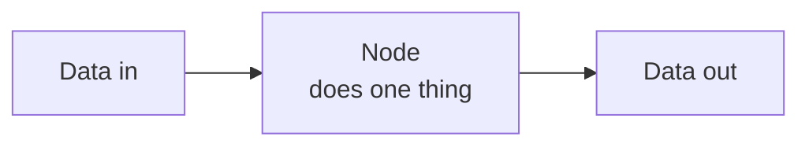
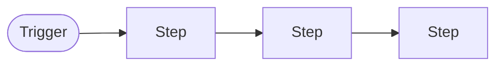
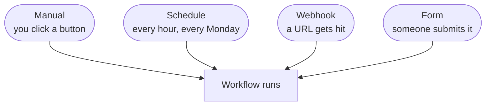
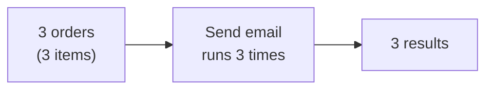
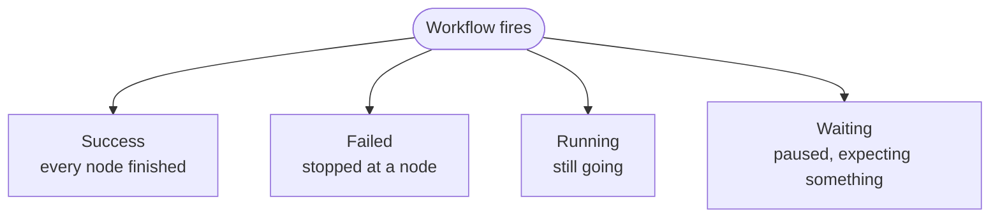
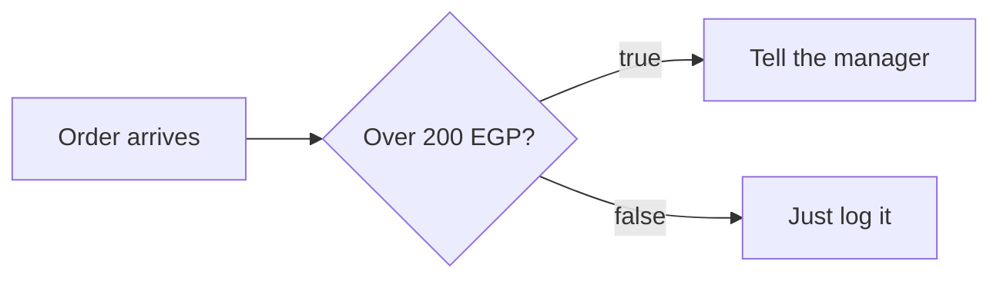
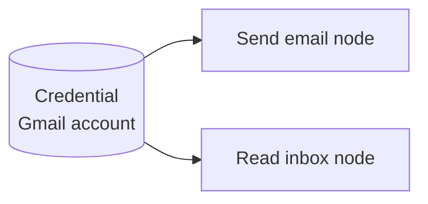
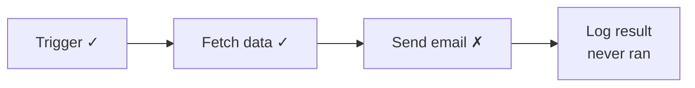

# n8n Foundations — for designers

Everything a designer needs to understand about n8n, and nothing more. You
will not build automations for a living. You need enough of the model to
design for the people who do.

Read this once before the session. It takes fifteen minutes.

---

## 1. The one idea

A **node** takes data in and hands data out. That's it. That is the whole
tool.



Everything else — the canvas, the hundreds of integrations, the AI steps — is
a variation on this one shape. When you open a node in n8n, the panel splits
in two for exactly this reason: input on the left, output on the right.

**Why you care:** that split panel is the most-used screen in the product, and
it is where most of the confusion lives. Look hard at it.

---

## 2. A workflow is nodes joined up



The first node is always a **trigger** — the thing that starts it. Every node
after it is a **step**.

A workflow does nothing until its trigger fires. This is not obvious to new
users and it is worth designing around.

---

## 3. Triggers — the four that matter



| Trigger | Fires when | Typical use |
|---|---|---|
| **Manual** | You click Execute | Testing, and only testing |
| **Schedule** | A clock | "Every morning, send me yesterday's orders" |
| **Webhook** | Another system calls a URL | "When Stripe takes a payment" |
| **Form** | Someone fills a form n8n hosts | "New client intake" |

**Why you care:** the trigger determines what the user can see. A scheduled
workflow runs while nobody is watching — so the *history* screen is the only
way to know what happened. A webhook workflow can fire a hundred times a
minute. Your dashboard has to survive both.

---

## 4. Data is a list, not a thing

This is the concept people get wrong, including developers.

Data moving between nodes is always a **list of items**, even when there's
only one. And a node runs **once per item**, automatically.



Nobody writes a loop. The node just repeats.

**Why you care:** "it worked when I tested it with one row" is the single most
common failure in automation. Your design has to answer: *how many items went
through, and did any of them fail while the rest succeeded?* A green tick on
the whole workflow is a lie if 2 of 50 items failed.

---

## 5. Runs (executions)

Every time a workflow fires, it produces a **run**. A run has one of four
states:



n8n keeps every run, with the exact data that passed through each node. You
can open a run from last Tuesday and see precisely what happened.

**Why you care:** this history is the richest data in the product and the
worst-designed screen in it. A user with forty workflows lives here. Two of
the four required screens in your brief are about this.

---

## 6. Branching

Workflows are not straight lines.



- **IF** — two outputs, true and false
- **Switch** — many outputs, one per case
- **Filter** — drops items that don't match, no second branch

**Why you care:** this is the hardest thing to draw. With three nodes it's
readable. With thirty and four branches it's a plate of spaghetti — and your
brief asks you to solve exactly that.

---

## 7. Credentials

A saved login for a service — a Gmail account, an API key. Stored once,
reused by any node that needs it.



**Why you care:** credentials expire, get revoked, and break workflows that
worked yesterday. "Your Google connection expired" is a failure state you
should design — it is a completely different problem from "the data was
wrong", and most tools show them identically.

---

## 8. Expressions

Anywhere you can type a value, you can instead insert data from an earlier
node, using `{{ }}`:

```
Hello {{ $json.customer }}, your total is {{ $json.total }} EGP
```

`$json` means "the current item". That's 90% of what you'll see.

**Why you care:** this is a text field that is secretly code. Users make typos
in it constantly and the error appears three nodes later. There is real design
work in making a field like this forgiving.

---

## 9. When something breaks

A failed node **stops the workflow**. The nodes after it never run.



The nodes before it *did* run — so a workflow can fail halfway, leaving real
side effects behind. Half an email campaign sent. Half a spreadsheet updated.

**Why you care:** this is deliverable 4 of your project. The user needs to
know which step broke, what already happened before it broke, and what to do
now. "Something went wrong" answers none of those.

---

## The nodes worth recognising

You don't need to memorise these. You need to recognise them on a canvas.

### Triggers

| Node | What it does |
|---|---|
| **Manual Trigger** | Runs when you click. Testing only. |
| **Schedule Trigger** | Runs on a clock. |
| **Webhook** | Gives you a URL; runs when that URL is called. |
| **n8n Form Trigger** | Hosts a form; runs on submit. |

### The everyday core

| Node | What it does | How often you'll see it |
|---|---|---|
| **Edit Fields (Set)** | Creates or reshapes fields | Constantly |
| **IF** | Splits into true / false | Constantly |
| **Switch** | Splits into many named routes | Often |
| **Filter** | Drops items that don't match | Often |
| **HTTP Request** | Calls any API | Constantly |
| **Merge** | Joins two branches back together | Often |
| **Code** | Runs JavaScript when nothing else fits | Sometimes |
| **Wait** | Pauses — minutes, or until a webhook | Sometimes |
| **No Operation** | Does nothing; marks a path's end | Often |
| **Sticky Note** | A note on the canvas, not a step | Everywhere |

### App nodes

Gmail, Google Sheets, Slack, Telegram, Notion, Airtable, Postgres, and roughly
four hundred others. They all follow the same shape: pick an action, pick a
credential, fill in fields.

**The design lesson:** four hundred nodes that all look identical is a search
problem, not a visual design problem. Look at how n8n's node picker handles
it, and ask whether you could do better.

### AI nodes

| Node | What it does |
|---|---|
| **Basic LLM Chain** | Send a prompt, get text back |
| **AI Agent** | An LLM that can call other nodes as tools |

**Why you care:** AI steps are slow (seconds, not milliseconds) and
unpredictable. A workflow with an AI node in it needs a different loading
design from one without. Most tools haven't caught up with this.

---

## What to look at during the session

Not the colours. These three things:

1. **The node panel** — the input/output split. It is the most-used screen.
2. **The canvas at scale** — three nodes is fine. Imagine thirty.
3. **The failure screen** — read it as though you didn't build the workflow
   and it's 3am. That's the user you're designing for.
